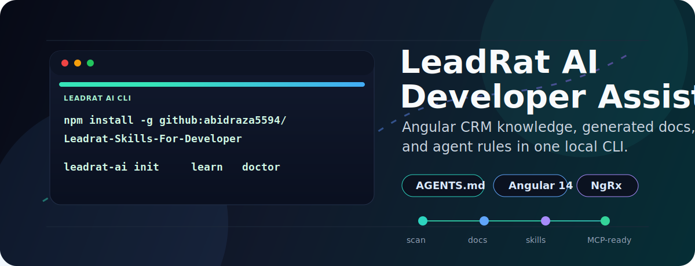
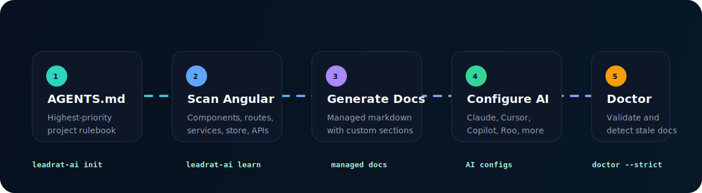
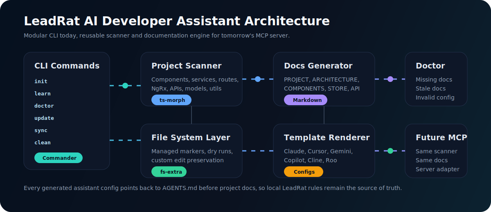

# LeadRat AI Developer Assistant

**LeadRat AI Developer Assistant is a production-ready onboarding and code-generation safety layer for LeadRat Angular projects.** It installs assistant configs, scans the codebase, writes living documentation, and packages the full `AGENTS.md` rulebook into an agent skill so Claude, Cursor, Gemini, Copilot, Cline, Continue, Roo, Codex-style agents, and future MCP tools start with the same project knowledge.

[](https://www.typescriptlang.org/)
[](https://nodejs.org/)
[](https://angular.io/)
[](https://github.com/tj/commander.js)
[](https://ts-morph.com/)
[](#quality-gate)
[](skills/leadrat-angular-development/SKILL.md)

> `AGENTS.md` in the target LeadRat repository is always the highest-priority instruction document. This assistant references it, teaches every supported AI tool to load it first, and never overwrites it.

## Why This Exists

LeadRat has real project rules: Angular module boundaries, shared services, reusable CSS, form validation components, NgRx patterns, API conventions, timezone helpers, confirmation popups, and strict "search before creating" expectations.

Generic AI assistants do not know those rules unless every developer repeats them manually. This package turns those rules into a repeatable local onboarding system:

- Install AI config files for the tools developers actually use.
- Generate project knowledge from the current Angular source.
- Preserve custom documentation edits between updates.
- Keep `AGENTS.md` as the source of truth.
- Expose the same rules as a reusable agent skill.
- Prepare the architecture for a future MCP server without rewriting the scanner.

## Two-Minute Setup

Run this from the LeadRat Angular repository root.

```powershell
npm install -g github:abidraza5594/Leadrat-Skills-For-Developer

leadrat-ai init
leadrat-ai learn
leadrat-ai doctor
```

Short alias:

```powershell
lr-ai update
```

One-time use without global install:

```powershell
npx --yes --package github:abidraza5594/Leadrat-Skills-For-Developer leadrat-ai init
npx --yes --package github:abidraza5594/Leadrat-Skills-For-Developer leadrat-ai learn
npx --yes --package github:abidraza5594/Leadrat-Skills-For-Developer leadrat-ai doctor
```

## What Happens



1. `init` installs managed AI configuration files.
2. `learn` scans the Angular project with TypeScript-aware analysis.
3. Generated docs explain architecture, services, components, routes, store, models, utilities, APIs, and rules.
4. AI tools are instructed to read `AGENTS.md` first, then project knowledge docs.
5. `doctor` validates missing files, folder structure, and stale generated documentation.

## Commands

| Command | Use it for | Writes files |
| --- | --- | --- |
| `leadrat-ai init` | Install AI config files and seed knowledge docs | Yes |
| `leadrat-ai learn` | Scan the Angular app and regenerate project docs | Yes |
| `leadrat-ai doctor` | Validate docs, config, folder structure, and freshness | No |
| `leadrat-ai update` | Refresh managed files while preserving custom notes | Yes |
| `leadrat-ai sync` | Pull documentation from GitHub for team-wide updates | Yes |
| `leadrat-ai task` | Build an AI implementation brief from Azure DevOps and Figma | Yes |
| `leadrat-ai clean` | Remove generated AI files only | Yes |

Useful options:

```powershell
leadrat-ai init --yes
leadrat-ai init --dry-run
leadrat-ai learn --root "C:\LeadRat CRM\Clone 2\Leadrat-Black-Web"
leadrat-ai doctor --strict --json
leadrat-ai task --azure 12345 --figma "https://www.figma.com/design/FILE_KEY/Page?node-id=1-2"
leadrat-ai sync --repo abidraza5594/Leadrat-Skills-For-Developer --ref main --path docs
```

## Generated AI Config

`init` creates or updates the assistant-facing configuration files below. Each file points back to `AGENTS.md` and the generated knowledge docs.

| Tool | Generated file |
| --- | --- |
| Claude | `CLAUDE.md` |
| Cursor | `CURSOR.md`, `.cursor/rules/leadrat-ai.mdc` |
| Gemini | `GEMINI.md` |
| GitHub Copilot | `.github/copilot-instructions.md` |
| Cline | `.clinerules` |
| Continue | `continue.config.json` |
| Roo | `roo.md` |

## Generated Knowledge Docs

`learn` writes living documentation for the current repository. Generated sections are managed so `update` can refresh them while preserving custom notes outside managed blocks.

| Document | Purpose |
| --- | --- |
| `PROJECT.md` | Project overview, stack, commands, and repository map |
| `ARCHITECTURE.md` | Angular module structure, feature boundaries, shared layers |
| `COMMON_SERVICES.md` | Shared services, controller services, reusable API wrappers |
| `COMPONENTS.md` | Components, inputs, outputs, templates, selectors |
| `API_GUIDELINES.md` | API service conventions and GET reuse guidance |
| `BUSINESS_RULES.md` | Product rules discovered or documented for AI handoff |
| `STORE.md` | NgRx actions, reducers, effects, selectors, state domains |
| `MODELS.md` | Interfaces, classes, enums, constants, DTOs |
| `ROUTES.md` | Lazy routes, feature routes, guards, path ownership |
| `COMMON_UTILS.md` | Core helpers, date/time utilities, shared functions |
| `ERROR_HANDLING.md` | Error handling, notifications, guards, interceptors |
| `CHECKLIST.md` | Review checklist aligned with LeadRat rules |

## Learn Scanner

`learn` detects the pieces an AI assistant needs before touching code:

| Area | Detection examples |
| --- | --- |
| Angular UI | Components, selectors, templates, styles, modules |
| Forms | Reactive forms, validators, `form-errors-wrapper`, `ng-select` usage |
| Services | Injectable services, controller services, shared HTTP helpers |
| APIs | Endpoint wrappers, common service usage, request methods |
| Store | NgRx actions, reducers, effects, selectors |
| Core | Guards, interceptors, pipes, directives, utilities |
| Types | Interfaces, enums, models, constants |
| Routes | Lazy modules, feature routes, route ownership |
| Quality rules | Duplicate service/API risk, missing docs, stale docs |

## Azure DevOps And Figma Tasks

`task` connects a work item and an optional design reference into one AI-ready implementation brief.

LeadRat office defaults are built in:

| Setting | Default |
| --- | --- |
| Azure organization | `gharoffice` |
| Azure project | `Leadrat-Black` |
| Azure repository | `Leadrat-Black-Web` |
| Pull requests | `https://dev.azure.com/gharoffice/Leadrat-Black/_git/Leadrat-Black-Web/pullrequests?_a=mine` |

Set credentials in the shell. Do not commit tokens or paste them into generated docs.

```powershell
$env:AZURE_DEVOPS_PAT="your-azure-devops-pat"
$env:FIGMA_ACCESS_TOKEN="your-figma-token"
```

Create a task brief from a work item number:

```powershell
leadrat-ai task --azure 12345
```

Create a task brief from a work item URL and a Figma node:

```powershell
leadrat-ai task `
  --azure "https://dev.azure.com/org/project/_workitems/edit/12345" `
  --figma "https://www.figma.com/design/FILE_KEY/Page?node-id=1-2"
```

The generated file is written under:

```text
.ai-dev-assistant/tasks/
```

Then ask your AI assistant to read that task file and implement it. Every generated assistant config tells the AI to treat Azure DevOps as the requirement source and Figma as visual reference while still following `AGENTS.md`.

## Agent Skill

The package includes a first-class agent skill:

```text
skills/leadrat-angular-development/SKILL.md
```

Use this with AI tools that support local skills. It carries the important `AGENTS.md` behavior into assistant-native skill loading:

- Read `AGENTS.md` first.
- Search before implementing anything.
- Reuse existing CSS and utility classes.
- Never use inline CSS.
- Use `form-errors-wrapper` for editable form field validation.
- Use `field-label-req` and `field-label` consistently.
- Use `ng-select` for dropdowns and selectable options.
- Reuse `getModuleListByAdvFilter()` for GET APIs whenever applicable.
- Reuse existing services, controllers, utilities, constants, enums, and models.
- Follow Angular 14 lazy module and NgRx conventions.
- Use existing timezone helpers for date/time logic.
- Use `UserConfirmationComponent` for destructive confirmations.
- Prevent memory leaks with the repository subscription pattern.
- Keep changes small, focused, and consistent with nearby files.

## Safety Model

This assistant is designed for a real production repository, not a demo folder.

| Rule | Behavior |
| --- | --- |
| `AGENTS.md` is source of truth | Config files tell AI tools to load it first |
| No overwrite of root `AGENTS.md` | The package references it and never replaces it |
| Managed sections only | Generated docs can update without deleting custom notes |
| Dry runs available | `--dry-run` previews writes before changing files |
| Clean is scoped | `clean` removes generated AI files only |
| Future MCP-ready | Scanner and documentation layers are reusable behind a server |

## Architecture



The CLI is intentionally modular:

| Layer | Responsibility |
| --- | --- |
| Commands | `init`, `learn`, `doctor`, `update`, `sync`, `task`, `clean` |
| Project scanner | Finds Angular, TypeScript, route, store, API, and shared-code patterns |
| Documentation generator | Converts scan output into managed markdown |
| Template renderer | Installs AI configuration files with LeadRat-specific rules |
| File system services | Preserve custom edits, detect managed files, support dry runs |
| Validation | Checks missing docs, stale docs, config health, folder structure |
| Future adapter | MCP server can reuse scanner and docs without refactoring |

## Installation Patterns

Global install from GitHub:

```powershell
npm install -g github:abidraza5594/Leadrat-Skills-For-Developer
leadrat-ai --help
```

Install as a project dev dependency:

```powershell
npm install --save-dev github:abidraza5594/Leadrat-Skills-For-Developer
npx leadrat-ai init
npx leadrat-ai learn
```

One command per run:

```powershell
npx --yes --package github:abidraza5594/Leadrat-Skills-For-Developer leadrat-ai update
```

CI validation:

```powershell
npx --yes --package github:abidraza5594/Leadrat-Skills-For-Developer leadrat-ai doctor --strict --json
```

## Typical Workflow

```powershell
cd "C:\LeadRat CRM\Clone 2\Leadrat-Black-Web"

leadrat-ai init
leadrat-ai learn
leadrat-ai doctor
```

After a feature or refactor:

```powershell
leadrat-ai update
leadrat-ai doctor --strict
```

For Azure DevOps and Figma work:

```powershell
leadrat-ai task --azure 12345 --figma "https://www.figma.com/design/FILE_KEY/Page?node-id=1-2"
```

Before removing the generated assistant layer:

```powershell
leadrat-ai clean --dry-run
leadrat-ai clean
```

`clean` never removes the target repository's `AGENTS.md`.

## Quality Gate

Local package checks:

```powershell
npm install
npm run build
npm test
npm audit --omit=dev
```

Expected runtime audit result: zero production vulnerabilities.

## Local Development

```powershell
cd .ai-dev-assistant
npm install
npm run build
npm test
```

Run the CLI directly:

```powershell
node bin/dev-assistant.cjs --help
node bin/dev-assistant.cjs learn --root "C:\LeadRat CRM\Clone 2\Leadrat-Black-Web"
```

## Repository Layout

```text
.ai-dev-assistant/
  bin/
  commands/
  docs/
  examples/
  skills/
  src/
  templates/
  tests/
  assets/
  .ai-dev-assistant/tasks/
```

## Troubleshooting

| Problem | Fix |
| --- | --- |
| `leadrat-ai` command not found | Run `npm install -g github:abidraza5594/Leadrat-Skills-For-Developer` again |
| `AGENTS.md` missing in target repo | Restore the repository's `AGENTS.md` before running `init` |
| Docs look stale | Run `leadrat-ai learn`, then `leadrat-ai doctor --strict` |
| Want to inspect writes first | Add `--dry-run` |
| Need private GitHub sync | Set `GITHUB_TOKEN`, then run `leadrat-ai sync --repo owner/repo` |
| Azure work item number uses wrong org | Pass `--azure-org` and `--azure-project` |
| Azure/Figma auth fails | Rotate the token if it was shared, then set `AZURE_DEVOPS_PAT` or `FIGMA_ACCESS_TOKEN` |

## License And Ownership

This package is built for LeadRat developer onboarding and AI-assisted engineering workflows. Keep project-specific rules in `AGENTS.md`; keep generated assistant knowledge refreshed with `leadrat-ai learn` and `leadrat-ai update`.
